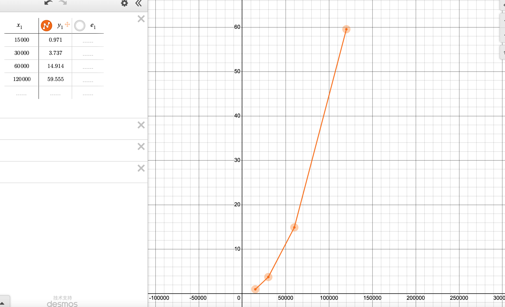
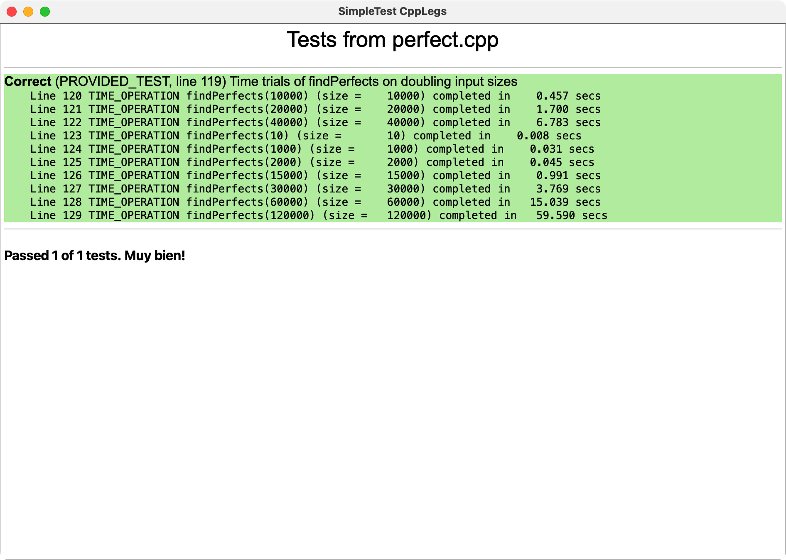
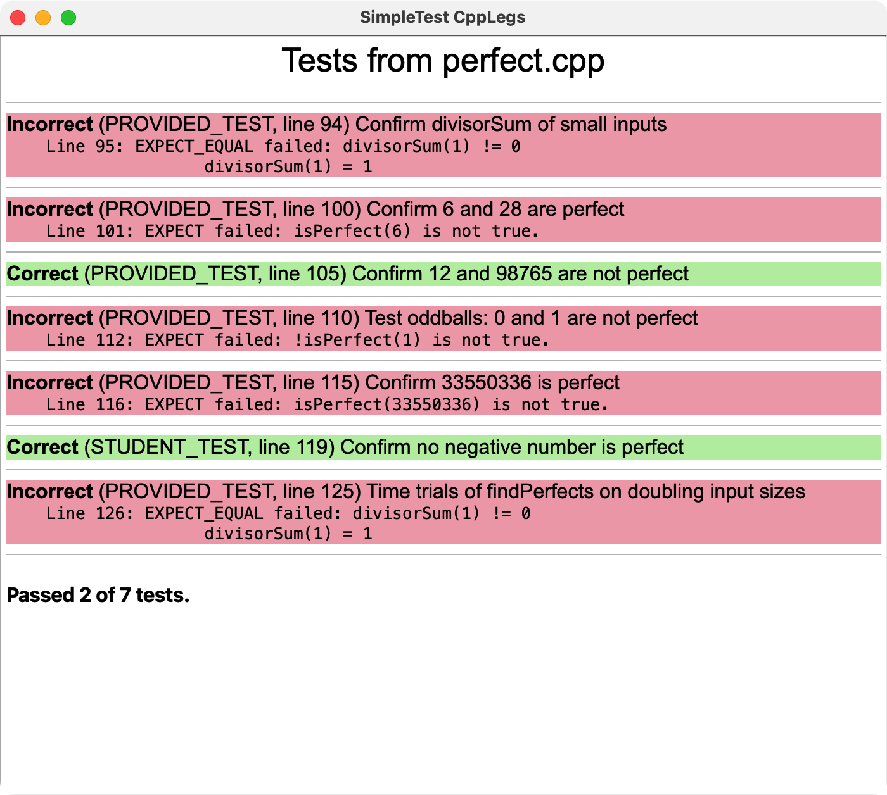
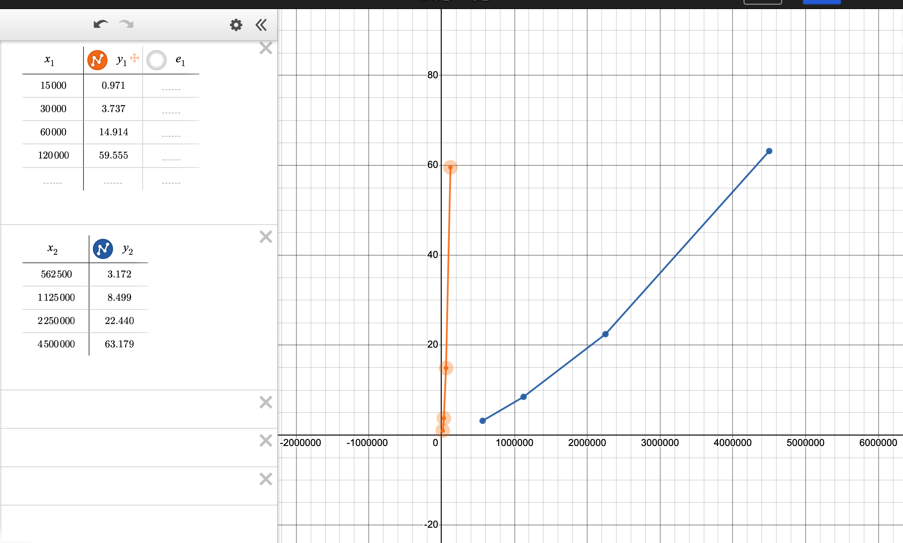

 **Q1**：该程序在你的电脑上执行了多久？共有多少个完全数，分别是哪些？


 **Q2**. 在表格中记录**`findPerfects`**的执行时间。

| 测试案例 | 执行时间    |
| -------- | ----------- |
| 15000    | 0.971 secs  |
| 30000    | 3.737 secs  |
| 60000    | 14.914 secs |
| 120000   | 59.555 secs |




 **Q3**. 对于 10 与 1000，计算 **`isPerfect`**是否做了同样多的工作？为什么一样多，或者为什么不一样多？对于搜索范围为 1-1000 的数，**`findPerfect`**其工作量是否与 1000-2000 时一致？为什么一样多，或者为什么不一样多？

- 不一样多

- 计算1000时，**` divisorSum `**需要花费更多的时间



**Q4**.  根据你收集到的数据进行推测：找出第五个数 **`findPerfect`** 要花费多少时间？

4537000 s

**Q5**. 这个函数测试失败时，其他测试是否还能通过？为什么？

不能通过，当测试中第一个调用出错时，测试结果就直接被判定为不通过了



**Q6**. 描述一下你的测试策略。

- 边界情况1要通过测试
- 对于一个已知的完全数要通过测试
- 平方根为整数的要通过测试

```c++
STUDENT_TEST("Confirm smarterSum is OK") {
    EXPECT_EQUAL(smarterSum(1), 0);
    EXPECT_EQUAL(smarterSum(6), 6);
    EXPECT_EQUAL(smarterSum(16), 15);
}
```

**Q7**.  在表格中记录**`findPerfectsSmarter`**的执行时间。

| 测试案例 | 执行时间    |
| -------- | ----------- |
| 562500   | 3.172 secs  |
| 1125000  | 8.499 secs  |
| 2250000  | 22.440 secs |
| 4500000  | 63.179 secs |



**Q8**. 推测：**`findPerfectsSmarter`** 找到第 5 个完全数需要多久？

20min

**Q9**. 阐述下你选择的测试案例的动机，解释下为什么你认为这几个测试可以确定函数 **`findNthPerfectEuclid`** 正常工作。

**Q10**. "Angelou" 的编码是多少呢？What is the code for your own surname?

A524/J000

**Q11**. 在写代码之前，自行进行头脑风暴，尝试把这个任务分解成几个小任务。简单描述一下你的分解过程。

- 去除非字母
- 字母全部大写
- 字母替换数字
- 第一个数字换为第一个字母
- 删除所有0
- 用0补齐4位
