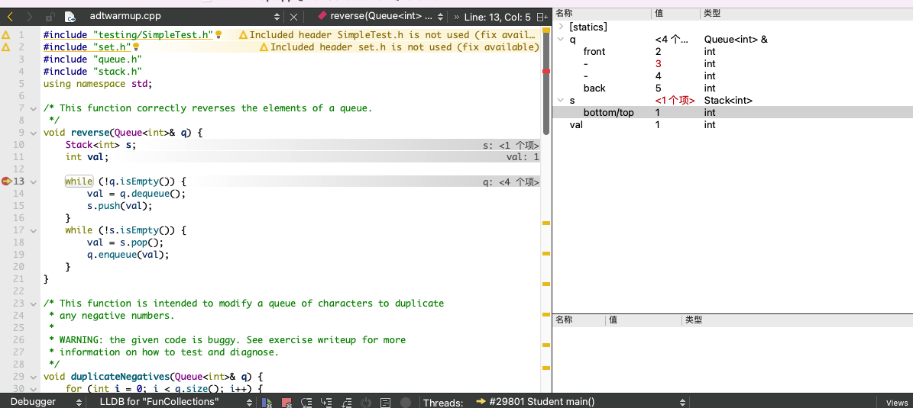

### Q1：在调试变量面板中，Stack 使用 top 和 bottom 标签标记栈的两端。那么当 Stack 仅包含一个元素时，这两个标签将如何显示？



```bottom/top```

```


```

### Q2：具体是什么情况，会造成函数无限循环执行？

出现负值,  i跟不上`q.size`的增长

### Q3：解释下你编辑过的代码是如何修复 `duplicateNegatives` 中的问题的。


```c++
void duplicateNegatives(Queue<int>& q) {
    int queueNum = q.size();
    for (int i = 0; i < queueNum; i++) {
        int val = q.dequeue();
        q.enqueue(val);
        if (val < 0) {
            q.enqueue(val);   // double up on negative numbers
            queueNum++;
            i++;
        }
    }
}
```

### Q4：思考下如何更好的修复 `sumStack` 中的 bug？


### Q5：讲义中提到，以引用的方式来传递比较大的数据结构是更有效率的方式。那么，为什么在函数中**`validatePath`**，传递参数**`path`**时采用的是传值而不是传递引用呢？


### Q6：写完测试后，描述下你的测试策略是如何确保 `validatePath` 正确工作的。


### Q7：根据 `res/tiny.txt` 数据库，画出反向索引数据结构的内容。


