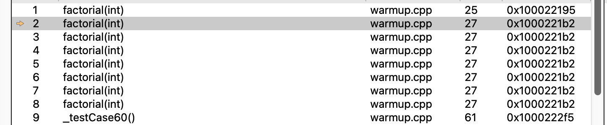
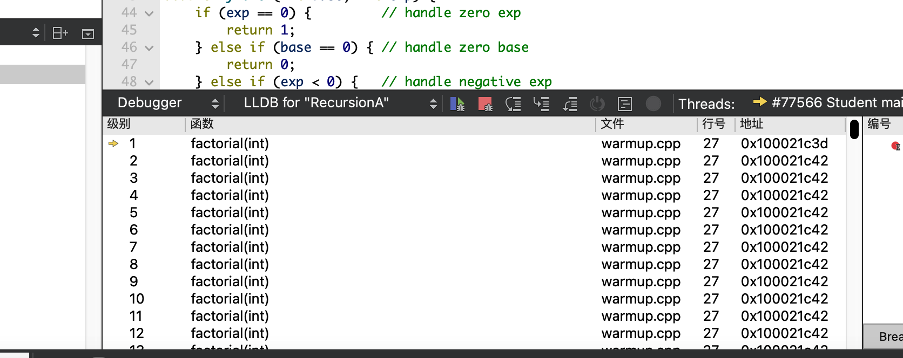
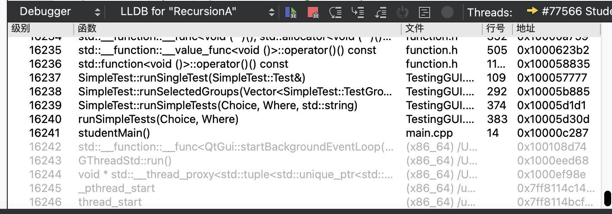

### **Q1**. 在调试器中查看调用栈，什么可以表明正在调试的程序使用了递归？

调用地址相同

### **Q2**. 从最外层减去最内层的数字，可以得到**调用栈**最大的**栈帧**数。你的系统调用栈中有多少个栈帧呢？

### **Q3**. 描述无限递归的症状与无限循环的症状有何不同。

无限递归最终会导致stack overf

### **Q4**. `base` 和 `exp` 导致测试失败的是什么情况？

exp为负数时，base不能为0

base为负数时，exp为偶数情况下，正负错误

### **Q5**. 在现有的五种情况下，是否有一些是重叠或多余的？你认为哪些是绝对必要的？有哪些 case 是你不确定的吗？

base小于0的情况可以去掉

### **Q6**. 将你的递归解决方案与下面的 `checkBalance` 迭代方法进行比较。你觉得哪个版本更容易阅读和理解？哪个版本更容易确认正确的行为？

### **Q7**. 假设采用递归实现，粗略估计一下你的系统可以成功合并的最大序列。

### **Q8**. 如果试图递归合并一个大于最大值的序列，将会发生什么行为？

