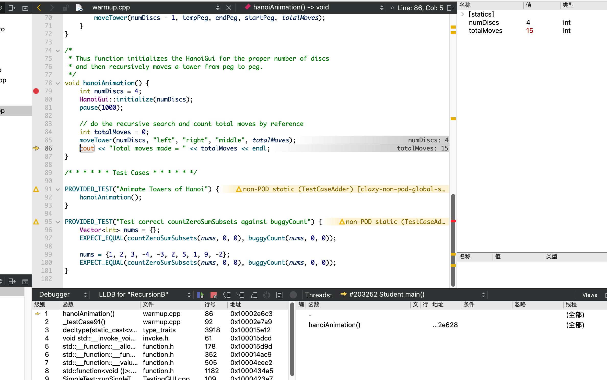
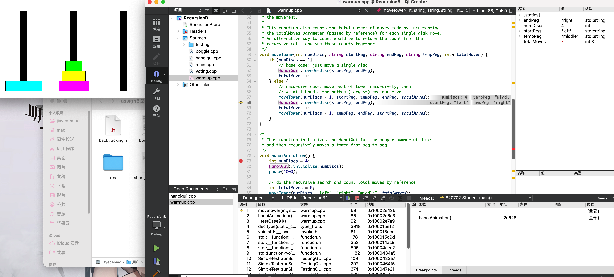
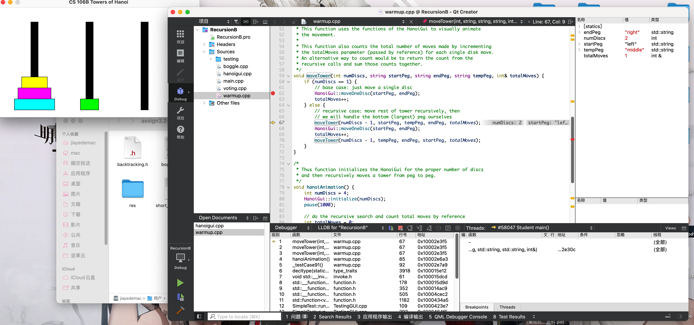

### **Q16**. 在 `hanoiAnimation` 中越过 `moveTower` 调用之后，`talMoves` 的值是什么？

15

### **Q17**. 在 Step Over 第一个递归子调用之后，`totalMoves` 变量的值是什么？（换句话说，在 else 语句中，只要 Step Over 第一个递归子调用 `moveTower`就可以执行 `moveTower`)

### **Q18**. 在 **moveTower** 的 Base Case 满足时选择 Step Out，你最终会在哪里结束？（你在哪个函数中，行号是多少？）此时，`totalMoves` 变量的值是多少？

### **Q19**. 你用来触发程序错误的最小可能输入是什么？

{1}

### **Q20**. 识别代码中的单字符错误，并解释为什么单字符错误会导致上述测试案例中的错误返回结果。你应该能够具体说明错误是如何导致结果从“完全正确”变为“严重错误”的。

### **Q20**. 识别代码中的单字符错误，并解释为什么单字符错误会导致上述测试案例中的错误返回结果。你应该能够具体说明错误是如何导致结果从“完全正确”变为“严重错误”的。

### **Q22**. 使用大 O 和计时数据来估计计算美国选举团中 51 个投票区的影响力指数需要多长时间。

