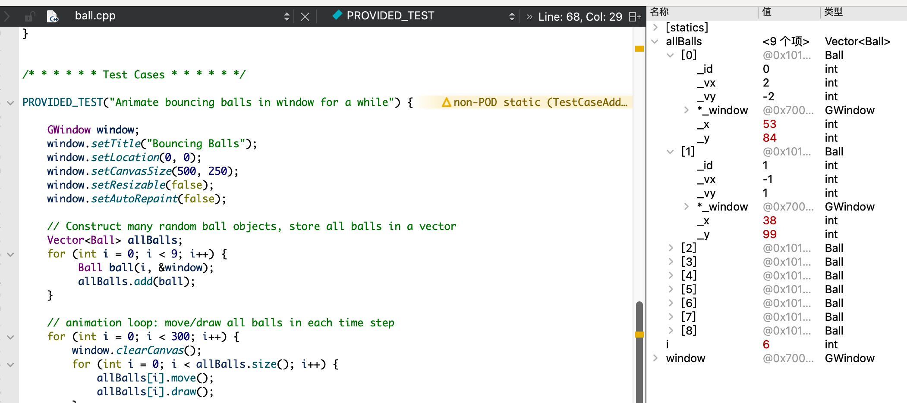
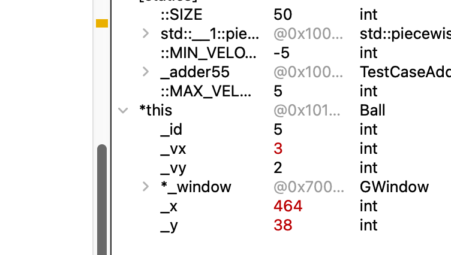
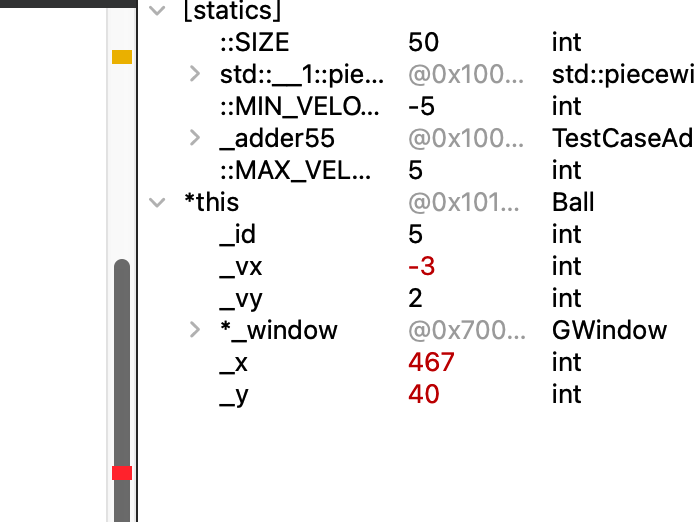
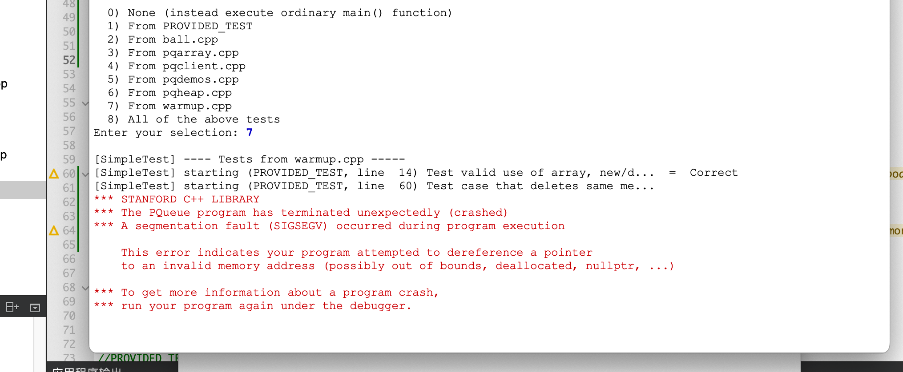
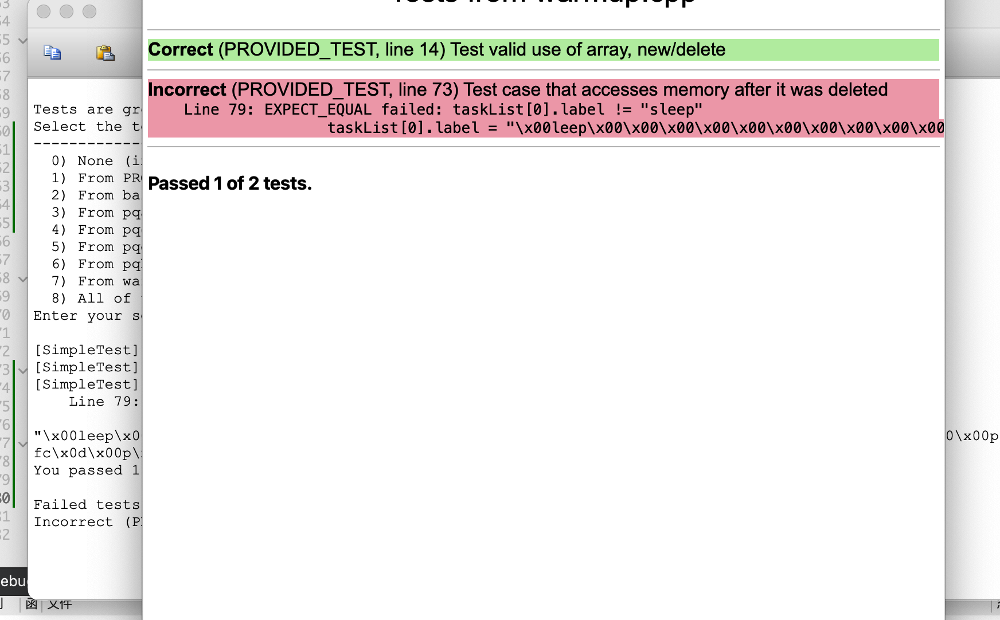

### **Q1**. **allBalls[0]** 成员变量的值如何在迭代中变化？具体来说，\_id、_x 和 _y 的值会发生什么？



\_id 不变 、\_x和\_y的值会加上速度


### **Q2**. 在不断的迭代中，卡住的球的成员变量是如何变化的？跟上一个问题的答案做个比较。





\_x值在两个固定值之间反复变化

### **Q3**. 强制把卡住的球放置到 `(0, 0)` 位置会恢复正常吗？还是仍然卡住？


### **Q4**. 在你的系统上，这些内存错误的观察结果是什么：       

- 访问分配的数组边界之外的索引？      

- 两次删除相同的内存？      

- 删除后访问内存？





### **Q5.** 接口 (`pqarray.h`) 和实现 (`pqarray.cpp`) 中都有大量注释。解释接口中的注释与实现中的注释为什么不同。考虑下文档的内容和受众。


### **Q6.** 该类声明了成员变量 `_numAllocated` 和 `_numFilled`。这两个计数有什么区别，为什么都需要？


### **Q7.** 尽管成员函数体内的代码可以直接访问对象的成员变量，但实现者可以选择调用公共成员函数来获取有关对象的信息。例如，请注意操作 `isEmpty()` 和 `peek()` 为何故意调用 `size()` 而不是使用 `_numFilled` 或者 `dequeue()` 为何调用  `peek()` 来检索最前面的元素。为什么这样的写法，被认为是更好的设计？


```c++
if ( _numFilled == _numAllocated ) {
           _numAllocated *= 2;
           //开辟新数组空间（临时）
           DataPoint* _temp = new DataPoint[_numAllocated]();     
            //转移数据
           for (int i = 0; i < _numFilled; i++) {
               _temp[i] = _element[i];
           }
           //删除临时数组
  				_elements = _temp;
           delete[] _temp;
       }
```


### **Q8**. 给出你的时间试验的结果，并解释它们如何支持你对入队和出队的 Big-O 运行时的预测。


### **Q9.** 基于入队/出队的大 O，如果基于 PQArray 实现，对 `pqSort` 的大 O 做一个预测？运行一些计时测试以确认你的预测，并将该数据包含在你的答案中。


### **Q10.** 基于入队/出队的大 O，如果使用 PQArray，你对 topK 的大 O 的 k 和 n 有什么期望？运行一些计时试验以确认你的预测，并将该数据包含在你的答案中。


### **Q11.** 从一个空的二叉堆开始，按如下所示的顺序将九个数据点排入队列并显示结果。您只需要显示最终堆，而不是中间步骤。将堆绘制为树状图，根元素在顶部，两个子元素在下面，依此类推。


### **Q12.** 在上面的二叉堆上进行两次出队调用并绘制更新的结果。


### **Q13.** 画出上面二叉堆的数组表示。用数组索引标记每个元素。


### **Q14.** 在 `pqclient.cpp` 上重新运行计时试验，并提供确认 pqSort 在 `O(NlogN)` 时间和 `O(NlogK)` 时间运行 topK 的结果。

