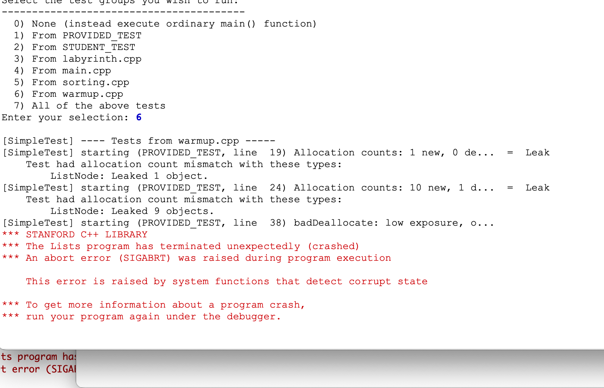
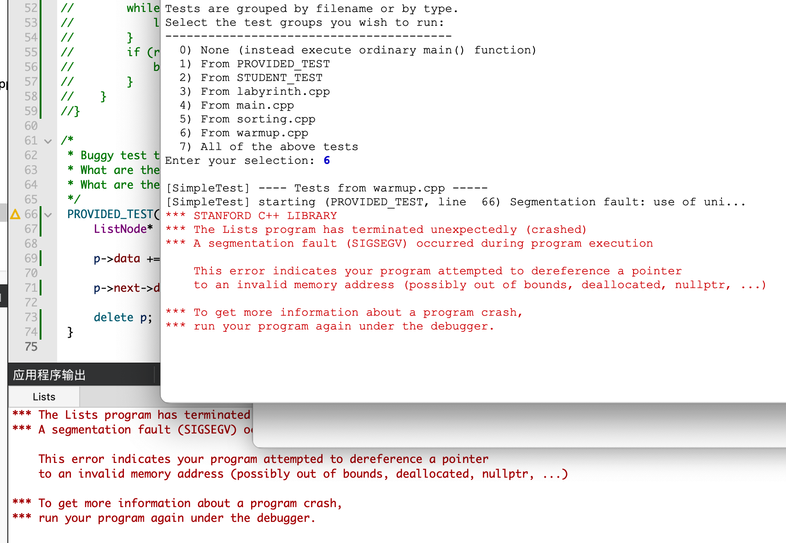

###  **Q1.** 测试用例的黄色背景在 SimpleTest 结果窗口中表示什么？ 

黄色窗口表示内存泄漏


###  **Q2.** 对已释放的内存地址使用 `delete` 的测试结果是什么？ 

内存错误


### **Q3.** 在你的系统上，观察到 `badDeallocate` 的后果是什么？错误代码在什么情况下（如果有）触发了错误或崩溃？



### **Q4.** 你的系统上如何呈现段错误？

- 

- 有时有错误，有时没有


### **Q5.** 你能想出其他收集所需物品的路径嘛？


### **Q6.** 如果 `deallocateList` 函数是递归实现的，请粗略估计它可以成功处理的最大长度列表。对于比最大值更长的列表，如果尝试收回内存，观察到的结果是什么？（提示：请参考你在作业 3 中的热身练习）


### **Q7.** `sort` 函数的原型通过引用获取 `ListNode*`。解释为什么指针本身需要通过引用传递，如果不这样做会产生什么后果。


```c++
if ( _numFilled == _numAllocated ) {
           _numAllocated *= 2;
           //开辟新数组空间（临时）
           DataPoint* _temp = new DataPoint[_numAllocated]();     
            //转移数据
           for (int i = 0; i < _numFilled; i++) {
               _temp[i] = _element[i];
           }
           //删除临时数组
  				_elements = _temp;
           delete[] _temp;
       }
```


### **Q8.** 运行时间测试并提供确认 `QuickSort` 为 `O(NlogN)` 的结果。构建触发最坏情况的输入，验证运行时间降级到 `O(N^2)`。


### **Q9.** 运行提供的计时试验，将你的链表快速排序与相同序列上的向量排序进行比较并报告结果。谁赢了，为什么？


